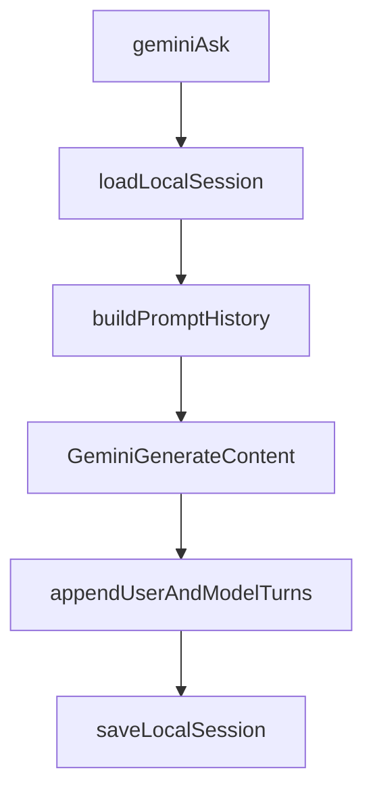

# wayfarer-bridge

Wayfarer Bridge (`wfb`) is a local, Python standard library-only CLI for moving useful context between terminal agents and Gemini. It is intentionally small: local files, SQLite, OAuth, and raw Gemini REST calls with no external Python package dependencies.

The project currently has two working context channels:

- **World state:** a local SQLite store for structured tasks, constraints, and style rules (`wfb seed`, `wfb status`).
- **Gemini chat memory:** local Gemini session files that make repeated `wfb gemini ask` calls coherent across turns (`wfb gemini session`, `wfb gemini ask`).

Direct attachment to active browser Gemini side-panel sessions is not available through the validated official Gemini API surface today. For now, `wfb` uses local session memory as the bridgeable, agent-friendly fallback.

**Installed from PyPI or any environment:** The ordered workflow (init, doctor, bridge vs chrome commands, multi-tab rules) is printed at the end of **`wfb --help`** under *Agent workflow guidance*, so you get the same playbook from a development alias, a global `pip install wfb`, or CI. This README and [docs/chrome_remote_debug_bridge.md](docs/chrome_remote_debug_bridge.md) add Chrome CDP detail.

## For terminal agents (Chrome CDP)

- **Debug instance only:** `wfb` only sees tabs on the Chrome process that exposes the remote-debug HTTP endpoint for the port and profile you use. A normal daily browser window without remote debugging does not appear in `wfb chrome targets`.
- **Blind or recovery start:** Run `wfb bridge doctor --format json` for endpoint reachability, requested vs resolved port, attachment state, and suggested next commands.
- **Port probing:** `wfb chrome capture`, `wfb chrome inspect`, `wfb chrome ax`, `wfb chrome find`, and `wfb bridge …` try the requested port first, then other detected debug ports. **`wfb chrome targets` and `wfb chrome attach` use `--port` only** (no automatic fallback). Use the port from doctor or pass `--port` explicitly when listing or attaching.
- **Goals → commands:** For **Gemini plus live page context with AOM auto-selection**, use **`wfb bridge ask`** / **`wfb bridge loop`** (default `--capture-mode auto`). For **read-only structured context without Gemini**, **`wfb chrome attach --target-id …`** then **`wfb chrome ax`** / **`wfb chrome find`**. For a **quick text-only snapshot**, **`wfb chrome capture`** — it re-resolves which tab to use on every invocation (bounded text via `inspect`, not the AX tree).
- **Stable tab vs blind capture:** `wfb chrome inspect`, **`ax`**, and **`find`** follow the **persisted attachment** when you omit `--target-id`. **`wfb chrome capture`** and **`wfb bridge ask`/`loop`** call target selection each time; with multiple tabs they may pick a different tab unless you pass **`--target-id`** or attach first and use inspect/ax/find.
- **Multi-tab rule:** If `chrome targets` lists more than one candidate, do not rely on blind `capture`/`bridge ask` without checking JSON **`warnings`** and **`selection.method`**, or pass **`--target-id`**. JSON may warn when the tab was chosen by heuristic and Chrome did not report an active target.
- **Metadata vs snapshot:** `chrome targets` and doctor list ids, titles, URLs, and types. **`capture`** is text-only; **`inspect`**, **`ax`**, **`find`**, and **`bridge`** supply bounded text and/or accessibility data. Sensitive URLs still show up in listings.
- **AOM on structured pages:** Prefer `wfb chrome ax --format outline` (after attaching to the right tab) over raising `--max-chars` on `chrome inspect`. The accessibility tree is screen-reader-style and dramatically more token-efficient than `body.innerText` for chat logs, forms, and component-heavy UIs. Use `wfb chrome find --query "..."` to locate text without re-fetching ever-larger snapshots.
- **Auto capture mode:** `wfb bridge ask` and `wfb bridge loop` default to `--capture-mode auto`, which inspects the AX tree, picks AOM when the page has meaningful structure, and falls back to text otherwise. Override with `--capture-mode text|aom|both` when you want a fixed strategy.
- **Internal Chrome URLs:** `chrome://…` pages often produce empty or unhelpful snapshots compared with normal `https://` tabs. When several targets exist (for example Google AI internal UI vs the search results page), prefer **`--target-id`** from `chrome targets`.

## What Works Today

- `wfb init` creates the local asset directory, initializes the SQLite DB, and runs OAuth login.
- `wfb seed` ingests a structured world-state JSON envelope into SQLite.
- `wfb status` prints a concise world-state summary in text or JSON.
- `wfb gemini ping` verifies authenticated Gemini API access.
- `wfb gemini ask` sends prompts to Gemini with local session continuity.
- `wfb gemini session ...` creates, switches, lists, resets, and inspects local chat sessions.
- `wfb gemini ask --auto-summarize on` can compact long local sessions with a Gemini-generated summary.
- `wfb chrome ...` can launch a debuggable Chrome instance, list page targets, attach one target, inspect bounded tab text context, capture the page accessibility tree (`chrome ax`), and search the page text and AX tree (`chrome find`).

Still not supported:

- Direct official Gemini API attachment to browser side-panel sessions.
- A centralized OAuth client secret for the open-source/PyPI path.
- Full text extraction from virtualized editors (Monaco, CodeMirror, react-window, etc.) embedded in target pages. See [KNOWN_ISSUES.md](KNOWN_ISSUES.md).

## Quick Start

Install locally (editable) from the repository root:

```sh
python3 -m pip install -e .
```

Then use:

```sh
wfb --help
```

You can also run the script directly:

```sh
python3 wfb.py --help
```

For isolated testing, install in a virtual environment first.

Set up OAuth:

1. Create a Google Cloud project and enable the Generative Language API.
2. Configure the OAuth consent screen and add yourself as a test user while developing.
3. Create an OAuth **Desktop app** client.
4. Download the JSON and place it at `~/.wfb/client_secret.json`.
5. Run `wfb init`, then `wfb gemini ping`.

Create a Gemini session and ask follow-up questions:

```sh
wfb gemini session new --name planning
wfb gemini ask --prompt "Remember that Wayfarer Bridge is stdlib-only."
wfb gemini ask --prompt "What constraint did I just mention?"
wfb gemini session inspect --format json
```

## Asset Layout

`~/.wfb/` is the canonical per-user asset directory.

| Path | Purpose |
|---|---|
| `~/.wfb/wayfarer.db` | Default SQLite world-state database. |
| `~/.wfb/client_secret.json` | User-provided OAuth Desktop client secret. |
| `~/.wfb/token.json` | Local OAuth token cache. |
| `~/.wfb/gemini_sessions/<session_id>.json` | Local Gemini chat session history and metadata. |
| `~/.wfb/gemini_active_session.json` | Pointer to the current active Gemini session. |
| `~/.wfb/chrome_debug_profile/` | Isolated Chrome profile dir for `wfb chrome launch --profile-mode isolated`. |
| `~/.wfb/chrome_attachment.json` | Persisted selected Chrome target for `wfb chrome inspect`. |

The global `--db PATH` flag overrides only the SQLite database path. Other CLI assets still live under `~/.wfb/`.

## CLI Reference

Global option:

```sh
wfb [--db PATH] <command> ...
```

### `wfb init [--no-open-oauth-guide] [--no-browser] [--force-login]`

- Ensures `~/.wfb/` exists.
- Initializes the SQLite schema at `--db PATH` or `~/.wfb/wayfarer.db`.
- Requires `~/.wfb/client_secret.json`.
- Runs OAuth login and stores token data at `~/.wfb/token.json`.
- `--no-open-oauth-guide` disables best-effort browser-open for setup instructions.
- `--no-browser` prints the OAuth URL instead of attempting to open a browser.
- `--force-login` ignores a valid cached token and reruns OAuth.

### `wfb seed (--json STRING | --file PATH) [--replace]`

Ingests a structured world-state envelope into SQLite. Default behavior is upsert by `id`; `--replace` clears all entity tables before inserting the supplied envelope.

### `wfb status [--format text|json] [--limit N]`

Prints the SQLite world-state summary. `--format json` emits deterministic machine-readable state; `--limit N` caps preview lists in text output.

### `wfb gemini ping [--limit N]`

Lists available Gemini model names using cached OAuth credentials.

### `wfb gemini ask --prompt STRING [options]`

Sends a prompt to Gemini using local session memory.

Options:

- `--model ID`: Gemini model id. Default: `gemini-2.5-flash`.
- `--session ID`: route this ask to a specific local session. Defaults to the active session.
- `--max-history-turns N`: include at most this many recent non-summary turns. Default: `30`.
- `--system TEXT`: system instruction override for this call.
- `--auto-summarize on|off`: opt into model-generated session compaction. Default: `off`.
- `--summarize-model ID`: optional model override used only for summary generation.
- `--sync-world-state on|off`: per-ask override for world-state sync.
- `--world-state-db PATH`: per-ask override for sync target DB.

If no active session exists, `ask` auto-creates one.

### `wfb gemini session current`

Prints the active local Gemini session id, if any.

### `wfb gemini session list`

Lists local sessions. The active session is marked with `*`.

### `wfb gemini session new [--name NAME] [--model ID] [--system TEXT] [sync options]`

Creates a new local session and makes it active.

Sync options:

- `--sync-world-state on|off`: default sync mode for this session.
- `--world-state-db PATH`: default target DB for this session's sync.
- `--world-state-scope TEXT`: optional scope tag injected into synced record metadata.

### `wfb gemini session use --id SESSION_ID [sync options]`

Makes an existing session active.

### `wfb gemini session reset [--id SESSION_ID]`

Clears message history for the target session. Defaults to the active session.

### `wfb gemini session inspect [--id SESSION_ID] [--format text|json]`

Inspects a local session. Defaults to the active session.

### `wfb chrome launch [--port N] [--profile-mode isolated|user] [--chrome-path PATH]`

Launches a Chrome instance with remote debugging enabled and verifies `/json/version`.
If a debug endpoint is already available on the port, `wfb` reuses it and skips spawning a new process.
If the requested port is unavailable, `wfb` auto-falls back to a detected healthy debug port.

- `--profile-mode isolated` (default): uses `~/.wfb/chrome_debug_profile/`.
- `--profile-mode user`: uses your normal Chrome profile (higher fidelity, higher risk).

### `wfb chrome targets [--port N] [--include-types page,webview] [--gemini-only] [--format text|json]`

Lists attachable CDP targets from `/json/list`.

- Default target types: `page` (backward-compatible behavior).
- `--include-types page,webview` includes Gemini side-panel webviews.
- `--gemini-only` narrows output to Gemini-related targets.

### `wfb chrome attach --target-id ID [--port N] [--include-types page,webview] [--format text|json]`

Stores the selected target in `~/.wfb/chrome_attachment.json` for later inspection.

- Default target types searched: `page`.
- Use `--include-types page,webview` when attaching Gemini side-panel IDs.

### `wfb chrome inspect [--target-id ID] [--port N] [--include-types page,webview] [--max-chars N] [--selector CSS] [--format text|json]`

Reads bounded tab context from CDP `Runtime.evaluate` and prints JSON by default:

- `url`, `title`
- `selected_text`
- `text_snapshot` (bounded/truncated exactly by `--max-chars`)
- capture metadata (`captured_at_unix`, length fields, target metadata)
- `selector`, `selector_matched` when `--selector CSS` is supplied

Inspect defaults are attachment-aware: when using a persisted attachment and no
explicit `--include-types` is provided, `wfb` auto-includes the attachment
target type (for example `webview`) so inspect can resolve saved side-panel
targets without extra flags.

`--selector CSS` evaluates `document.querySelector(selector)` and returns only that
element's `innerText`. When the selector matches nothing, JSON output reports
`selector_matched: false`, the snapshot is empty, and a recovery hint is written to
stderr instead of silently falling back to `body.innerText`.

**Debug-port probing**: `inspect` tries your `--port` (default `9222`) first,
then other locally detected debugging ports in stable order until
`/json/list` succeeds — same ordering as `chrome capture`/`bridge`. When JSON
output is enabled, a top-level `debug` object documents
`requested_port`, `resolved_port`, and whether a fallback port was used
(`fallback_used`).

### `wfb chrome ax [--target-id ID] [--port N] [--include-types page,webview] [--role ROLE] [--name SUBSTRING] [--depth N] [--max-nodes N] [--name-max-chars N] [--ignored on|off] [--timeout-seconds F] [--format outline|json]`

Reads the page Accessibility Tree using CDP `Accessibility.getFullAXTree` and renders
a screen-reader-style outline. Designed to replace the "raise `--max-chars` and re-run"
pattern on structured pages: outlines are typically an order of magnitude smaller than
the equivalent `body.innerText` snapshot.

Outline format example:

```
WebArea
  main "Conversation"
    log "Messages"
      paragraph "Hi there"
      paragraph "How can I help?"
    textbox "Compose" focused level=1
    button "Send" disabled
```

- `--role ROLE` and `--name SUBSTRING` narrow the rendered outline to subtrees rooted at
  matching nodes. Useful for "show me only the `main` landmark" or "only the `log`
  region" without scanning the entire page.
- `--depth N` is forwarded to CDP as a source-side bound on tree size.
- `--max-nodes N` (default `600`) caps rendered nodes; `--name-max-chars N` (default
  `120`) truncates very long accessible names with a `"…(+N chars)"` indicator.
- `--ignored on` includes AX nodes flagged as ignored (default skips them and re-emits
  their non-ignored children at the parent depth, matching screen-reader behavior).
- JSON output includes `outline_meta`, `ax_quality` (`meaningful_roles`,
  `generic_roles`, `meaningful_ratio`), filter echo, normalized `nodes` (with
  `backend_dom_node_id` for future write-path commands), and `debug`.

Example:

```sh
wfb chrome ax --format outline
wfb chrome ax --format json --role textbox
wfb chrome ax --format outline --name "send" --max-nodes 80
```

### `wfb chrome find --query STRING [--mode text|aom|both] [--target-id ID] [--port N] [--include-types page,webview] [--selector CSS] [--role ROLE] [--max-results N] [--context-chars N] [--max-chars N] [--ax-depth N] [--timeout-seconds F] [--format text|json]`

Searches the page once and returns matches with surrounding context.

- `--mode text` searches the page text snapshot (or selector subtree text). Each match
  includes `before`, `match`, `after`, and the byte offset.
- `--mode aom` searches AX node names (case-insensitive) and returns each match plus a
  role/name breadcrumb path from the AX root.
- `--mode both` (default) does both and returns each list separately.
- `--selector CSS` scopes text-mode search to a subtree.
- `--role ROLE` restricts AOM matches to a specific role.

Designed to replace the "raise `--max-chars` and retry" workflow: instead of repeatedly
re-fetching larger snapshots, ask exactly the question you want to answer ("does the
page mention `error`?", "is there a button named `Send`?").

Example:

```sh
wfb chrome find --query "session expired" --mode both
wfb chrome find --query "Send" --mode aom --role button --format json
wfb chrome find --query "TODO" --mode text --selector "main" --context-chars 60
```

### `wfb chrome detach`

Clears the persisted attachment file.

### `wfb chrome current [--format json|text]`

Shows the current persisted attachment and endpoint health. Default output is JSON.

### `wfb chrome capture [--target-id ID] [--port N] [--include-types page,webview] [--gemini-only] [--max-chars N] [--selector CSS] [--format json|text]`

Runs discover -> attach -> inspect in one deterministic command.

- Defaults to `--include-types page,webview` for side-panel compatibility.
- Selection priority: explicit `--target-id`, then focused/active target, then heuristic ranking, then first-candidate fallback.
- `--selector CSS` scopes text snapshot to a subtree (same semantics as `chrome inspect`).
- JSON output includes `selection`, `target`, `attachment`, `inspect`, and debug ports (`requested_port`, `resolved_port`).

### `wfb bridge doctor [--port N] [--include-types page,webview] [--gemini-only] [--format json|text]`

Read-only diagnostics for agents: endpoint reachability (`/json/version`), target
summaries (`/json/list`), persisted attachment state, Gemini session id, and
ordered **recommendations** (recover / happy-path next commands). Default format
is JSON; `--format text` prints a compact checklist.

Example:

```sh
wfb bridge doctor
wfb bridge doctor --include-types page,webview --gemini-only --format text
```

### `wfb bridge ask --prompt "..." [--session ID] [--model MODEL] [--system TEXT] [--port N] [--target-id ID] [--include-types page,webview] [--gemini-only] [--max-chars N] [--selector CSS] [--capture-mode text|aom|both|auto] [--ax-max-nodes N] [--ax-name-max-chars N] [--format json|text]`

Runs the full browser-to-Gemini pipeline in one command: capture -> prompt envelope -> Gemini ask.

- Captures browser context via the same logic as `chrome capture`/`chrome ax` (including unified debug-port probing: `requested_port` vs `resolved_port` in the `capture` section when fallback occurs).
- `--capture-mode auto` (default) inspects the AX tree, picks AOM when the page has at least 5 meaningful AX roles and a `meaningful_ratio >= 0.3`, and falls back to text otherwise. Override with `text`, `aom`, or `both` for a fixed strategy.
- `--selector CSS` scopes text snapshot to a subtree (same semantics as `chrome inspect`).
- `--ax-max-nodes` / `--ax-name-max-chars` bound AOM outline size when capture-mode includes AOM.
- Builds a versioned prompt envelope (template `"2"`) embedding the chosen capture content and user prompt.
- Sends the composed prompt to Gemini within the target session (creates one if none active).
- Appends both the composed prompt and model response to session history.

JSON output includes three provenance sections:
- `capture`: target selection, snapshot metadata, `selector`/`selector_matched`, `mode_requested`/`mode_chosen`/`mode_reason`, `ax_quality`, debug ports.
- `prompt_envelope`: template version, original user prompt, composed prompt character count, and `budget` (chosen capture mode, text snapshot chars/truncation, AX total/rendered nodes, outline truncation).
- `gemini_response`: model, session id, full answer text.

Example:

```sh
wfb bridge ask --prompt "summarize the feedback on this page" --format json
wfb bridge ask --prompt "extract the test failures" --capture-mode aom --format text
wfb bridge ask --prompt "what's in the main article?" --selector "main article"
```

### `wfb bridge loop --prompt "..." [--max-iterations N] [--stability-check on|off] [--session ID] [--model MODEL] [--system TEXT] [--port N] [--target-id ID] [--include-types page,webview] [--gemini-only] [--max-chars N] [--selector CSS] [--capture-mode text|aom|both|auto] [--ax-max-nodes N] [--ax-name-max-chars N] [--format json|text]`

Runs a bounded iterative automation loop: each iteration captures browser context and asks Gemini about it.

- Uses the same capture path as `wfb bridge ask` for port probing, capture-mode selection, and provenance (`requested_port`/`resolved_port` per iteration).
- `--max-iterations N` (default 3): hard upper bound on iterations.
- `--stability-check on`: stops early if the captured content (text snapshot and/or AX outline depending on capture mode) is unchanged between iterations.
- Each iteration produces full provenance in the output transcript, including the per-iteration `prompt_envelope.budget`.

Stop reasons:
- `max_iterations`: budget exhausted normally.
- `no_change`: stability check detected identical content.
- `error`: a capture or ask stage failed (error details in the iteration record).

JSON output includes:
- `run`: start/end timestamps, iteration budget, stop reason.
- `iterations[]`: per-step capture, prompt_envelope, gemini_response, and status.
- `summary`: last answer, session id, model, and stop reason.

Example:

```sh
wfb bridge loop --prompt "check for new test results" --max-iterations 5 --stability-check on
wfb bridge loop --prompt "summarize changes" --capture-mode aom --format text
```

## Gemini Sessions For Agents

The Gemini REST calls used by `wfb` do not return a reusable API-managed conversation handle. See `docs/gemini_session_discovery.md` for the discovery notes.

`wfb` therefore maintains local session history:



Session behavior:

- `wfb gemini ask` targets the active session by default.
- `--session ID` overrides routing for one call and makes that session active.
- Each successful ask appends both the user prompt and Gemini response.
- `session inspect --format json` exposes the stored history for orchestration.
- `session reset` clears a session without deleting the session file.

## Chat To World-State Sync

`wfb` can distill chat context into the SQLite world-state store after successful asks.

Mode and source of truth:

- Chat is primary context.
- World state is extracted, structured output.
- Sync is session-default configurable and per-ask overridable.

Enable sync by default for a session:

```sh
wfb gemini session new --name triage --sync-world-state on
```

Or update an existing session:

```sh
wfb gemini session use --id sess_abc --sync-world-state on --world-state-db ~/.wfb/wayfarer.db --world-state-scope triage
```

Override for a single ask:

```sh
wfb gemini ask --prompt "..." --sync-world-state on --world-state-db ~/.wfb/wayfarer.db
```

Pipeline:

1. `ask` gets model response and persists chat turns.
2. If sync is enabled, `wfb` asks Gemini to emit a strict v1 seed envelope JSON.
3. Envelope is validated with the same `seed` validators.
4. Valid rows are upserted into the target DB via `seed_db(...)`.

Failure semantics:

- Sync failures are non-fatal for chat continuity.
- Ask still succeeds and prints response.
- Sync failures are emitted as deterministic warnings to stderr.

### Session Summarization

Summarization is opt-in:

```sh
wfb gemini ask --auto-summarize on --prompt "continue"
```

When enabled and a session exceeds model-aware drift thresholds, `wfb` asks Gemini to summarize older turns. It then stores a synthetic `history_summary` message plus recent raw turns.

Important safety details:

- Summaries are Gemini-generated only; there is no deterministic fallback.
- If summary generation fails, `ask` fails and reports the API error.
- Compacted state is persisted only after the final ask succeeds, so transient final-call failures do not overwrite raw history.
- Summary artifacts are always included in prompt history even when `--max-history-turns` trims older ordinary turns.
- Thresholds are drift heuristics, not hard Gemini context-window limits.

## OAuth Setup

The open-source `wfb` CLI does not ship a centralized OAuth client secret. Users provide their own Desktop OAuth client JSON at:

```text
~/.wfb/client_secret.json
```

Reference:

- [Gemini OAuth quickstart](https://ai.google.dev/gemini-api/docs/oauth)

Troubleshooting:

- If browser-open fails, copy/paste the printed auth URL manually.
- For headless/manual environments, run `wfb init --no-browser`.
- If token refresh fails, rerun `wfb init --force-login`.
- In testing-mode OAuth projects, refresh tokens may expire periodically and require re-login.

## World-State Reference

The SQLite world-state store is the original relational context channel. It is useful for durable, structured facts that agents should be able to query or summarize without replaying chat history.

### Seed Envelope

Top-level JSON object:

| Field | Required | Notes |
|---|---:|---|
| `version` | Yes | Integer; must equal `1`. |
| `generated_at` | No | ISO-8601 UTC string recommended. |
| `source` | No | Short origin label, e.g. `gemini` or `cursor`. |
| `active_tasks` | No | Array; omit or `[]` for none. |
| `environmental_constraints` | No | Array; omit or `[]` for none. |
| `style_specifications` | No | Array; omit or `[]` for none. |

Example:

```json
{
  "version": 1,
  "generated_at": "2026-05-05T23:00:00Z",
  "source": "gemini",
  "active_tasks": [],
  "environmental_constraints": [],
  "style_specifications": []
}
```

### Record Shapes

Validation runs before any DB writes. `metadata`, when present, must be a JSON object and is stored as compact JSON text in `metadata_json`.

#### `active_tasks[]`

| Field | Required | Type | Constraints |
|---|---:|---|---|
| `id` | Yes | string | Primary upsert key. |
| `title` | Yes | string | |
| `status` | Yes | string | One of `pending`, `in_progress`, `blocked`, `done`. |
| `priority` | No | int | Default `0`. |
| `owner` | No | string | |
| `due_at` | No | string | ISO-8601 recommended. |
| `notes` | No | string | |
| `source` | No | string | Overrides envelope `source`. |
| `metadata` | No | object | |

#### `environmental_constraints[]`

| Field | Required | Type | Constraints |
|---|---:|---|---|
| `id` | Yes | string | Primary upsert key. |
| `kind` | Yes | string | One of `tool_version_warning`, `policy`, `runtime_limit`, `dependency`, `other`. |
| `name` | Yes | string | |
| `value` | Yes | string | |
| `severity` | Yes | string | One of `info`, `warn`, `error`. |
| `scope` | No | string | e.g. `global`, `repo`, `task:<id>`. |
| `source` | No | string | Overrides envelope `source`. |
| `metadata` | No | object | |

#### `style_specifications[]`

| Field | Required | Type | Constraints |
|---|---:|---|---|
| `id` | Yes | string | Primary upsert key. |
| `category` | Yes | string | One of `tone`, `formatting`, `coding_style`, `workflow`, `other`. |
| `rule` | Yes | string | |
| `priority` | No | int | Default `0`. |
| `applies_to` | No | string | e.g. `all`, `python`, `docs`. |
| `source` | No | string | Overrides envelope `source`. |
| `metadata` | No | object | |

### Upsert Semantics

- Rows are inserted or updated by `id`.
- `updated_at` is refreshed on every successful write.
- Row `source` uses item `source`, then envelope `source`, then `NULL`.
- Unknown top-level envelope keys are rejected.
- Unknown keys inside entity records are rejected.

### SQLite Schema

`wfb init` creates a v1 schema with one `schema_version` row and three entity tables:

- `active_tasks`
- `environmental_constraints`
- `style_specifications`

Indexes:

- `idx_active_tasks_status`
- `idx_constraints_severity`
- `idx_style_priority`

The implementation source of truth is `wfb_db.py`.

### `wfb status --format json`

Top-level shape:

```json
{
  "version": 1,
  "db_path": "/Users/you/.wfb/wayfarer.db",
  "summary": {
    "tasks": {
      "pending": 0,
      "in_progress": 0,
      "blocked": 0,
      "done": 0
    },
    "constraints": {
      "info": 0,
      "warn": 0,
      "error": 0
    },
    "style_specifications": 0
  },
  "highlights": {
    "tasks": [],
    "constraints": [],
    "style_specifications": []
  },
  "updated_at": {
    "active_tasks": null,
    "environmental_constraints": null,
    "style_specifications": null
  }
}
```

`db_path` is the resolved absolute database path. `highlights.*` rows use SQL column names; `metadata_json` remains a JSON string.

## Exit Codes

| Code | Meaning |
|---:|---|
| `0` | Success. |
| `2` | CLI usage / argument error. |
| `3` | Validation error. |
| `4` | Database error. |
| `5` | File I/O, OAuth, token refresh, network, or Gemini API error. |

## Implementation Notes

- Python standard library only.
- No external Python package requirements.
- `wfb.py` is the CLI entrypoint.
- Supporting modules:
  - `wfb_paths.py`: local asset paths.
  - `wfb_db.py`: SQLite schema and lifecycle.
  - `wfb_oauth.py`: OAuth installed-app flow and token storage.
  - `wfb_gemini_api.py`: Gemini REST client, model calls, summarization.
  - `wfb_gemini_sessions.py`: local session storage and compaction helpers.
  - `wfb_chrome_bridge.py`: stdlib CDP discovery, websocket, and page inspection helpers.
  - `wfb_chrome_session.py`: persisted Chrome target attachment record helpers.

The security posture is intentionally conservative: local-first, stdlib-only, no shared OSS OAuth client secret, and no vendored third-party libraries yet. A deeper security review is still future work.

## Known Limits / Next Work

- No direct browser Gemini session attach through official API endpoints validated so far.
- Chrome bridge is currently macOS-focused for launch ergonomics.
- `wfb chrome inspect` is read-only text extraction only (no click/type/navigation automation).
- No retry/backoff policy for transient Gemini `429` / `503` errors yet.
- No tool/function-calling support yet.
- Summarization thresholds are heuristic and should be adjusted with real usage.
- Planned next CLI ergonomics after webview support include wrapper capture flow and trust-profile work.
