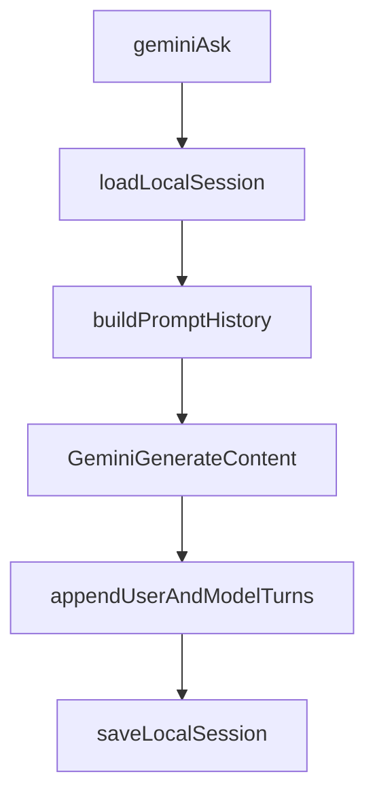

# wayfarer-bridge

Wayfarer Bridge (`wfb`) is a local, Python standard library-only CLI for moving useful context between terminal agents and Gemini. It is intentionally small: local files, SQLite, OAuth, and raw Gemini REST calls with no external Python package dependencies.

The project currently has two working context channels:

- **World state:** a local SQLite store for structured tasks, constraints, and style rules (`wfb seed`, `wfb status`).
- **Gemini chat memory:** local Gemini session files that make repeated `wfb gemini ask` calls coherent across turns (`wfb gemini session`, `wfb gemini ask`).

Direct attachment to active browser Gemini side-panel sessions is not available through the validated official Gemini API surface today. For now, `wfb` uses local session memory as the bridgeable, agent-friendly fallback.

## What Works Today

- `wfb init` creates the local asset directory, initializes the SQLite DB, and runs OAuth login.
- `wfb seed` ingests a structured world-state JSON envelope into SQLite.
- `wfb status` prints a concise world-state summary in text or JSON.
- `wfb gemini ping` verifies authenticated Gemini API access.
- `wfb gemini ask` sends prompts to Gemini with local session continuity.
- `wfb gemini session ...` creates, switches, lists, resets, and inspects local chat sessions.
- `wfb gemini ask --auto-summarize on` can compact long local sessions with a Gemini-generated summary.

Not yet supported:

- Direct connection to active Gemini browser tabs or side-panel sessions.
- A centralized OAuth client secret for the open-source/PyPI path.

## Quick Start

Install locally (editable) from the repository root:

```sh
python3 -m pip install -e .
```

Then use:

```sh
wfb --help
```

You can also run the script directly:

```sh
python3 wfb.py --help
```

For isolated testing, install in a virtual environment first.

Set up OAuth:

1. Create a Google Cloud project and enable the Generative Language API.
2. Configure the OAuth consent screen and add yourself as a test user while developing.
3. Create an OAuth **Desktop app** client.
4. Download the JSON and place it at `~/.wfb/client_secret.json`.
5. Run `wfb init`, then `wfb gemini ping`.

Create a Gemini session and ask follow-up questions:

```sh
wfb gemini session new --name planning
wfb gemini ask --prompt "Remember that Wayfarer Bridge is stdlib-only."
wfb gemini ask --prompt "What constraint did I just mention?"
wfb gemini session inspect --format json
```

## Asset Layout

`~/.wfb/` is the canonical per-user asset directory.

| Path | Purpose |
|---|---|
| `~/.wfb/wayfarer.db` | Default SQLite world-state database. |
| `~/.wfb/client_secret.json` | User-provided OAuth Desktop client secret. |
| `~/.wfb/token.json` | Local OAuth token cache. |
| `~/.wfb/gemini_sessions/<session_id>.json` | Local Gemini chat session history and metadata. |
| `~/.wfb/gemini_active_session.json` | Pointer to the current active Gemini session. |

The global `--db PATH` flag overrides only the SQLite database path. Other CLI assets still live under `~/.wfb/`.

## CLI Reference

Global option:

```sh
wfb [--db PATH] <command> ...
```

### `wfb init [--no-open-oauth-guide] [--no-browser] [--force-login]`

- Ensures `~/.wfb/` exists.
- Initializes the SQLite schema at `--db PATH` or `~/.wfb/wayfarer.db`.
- Requires `~/.wfb/client_secret.json`.
- Runs OAuth login and stores token data at `~/.wfb/token.json`.
- `--no-open-oauth-guide` disables best-effort browser-open for setup instructions.
- `--no-browser` prints the OAuth URL instead of attempting to open a browser.
- `--force-login` ignores a valid cached token and reruns OAuth.

### `wfb seed (--json STRING | --file PATH) [--replace]`

Ingests a structured world-state envelope into SQLite. Default behavior is upsert by `id`; `--replace` clears all entity tables before inserting the supplied envelope.

### `wfb status [--format text|json] [--limit N]`

Prints the SQLite world-state summary. `--format json` emits deterministic machine-readable state; `--limit N` caps preview lists in text output.

### `wfb gemini ping [--limit N]`

Lists available Gemini model names using cached OAuth credentials.

### `wfb gemini ask --prompt STRING [options]`

Sends a prompt to Gemini using local session memory.

Options:

- `--model ID`: Gemini model id. Default: `gemini-2.5-flash`.
- `--session ID`: route this ask to a specific local session. Defaults to the active session.
- `--max-history-turns N`: include at most this many recent non-summary turns. Default: `30`.
- `--system TEXT`: system instruction override for this call.
- `--auto-summarize on|off`: opt into model-generated session compaction. Default: `off`.
- `--summarize-model ID`: optional model override used only for summary generation.
- `--sync-world-state on|off`: per-ask override for world-state sync.
- `--world-state-db PATH`: per-ask override for sync target DB.

If no active session exists, `ask` auto-creates one.

### `wfb gemini session current`

Prints the active local Gemini session id, if any.

### `wfb gemini session list`

Lists local sessions. The active session is marked with `*`.

### `wfb gemini session new [--name NAME] [--model ID] [--system TEXT] [sync options]`

Creates a new local session and makes it active.

Sync options:

- `--sync-world-state on|off`: default sync mode for this session.
- `--world-state-db PATH`: default target DB for this session's sync.
- `--world-state-scope TEXT`: optional scope tag injected into synced record metadata.

### `wfb gemini session use --id SESSION_ID [sync options]`

Makes an existing session active.

### `wfb gemini session reset [--id SESSION_ID]`

Clears message history for the target session. Defaults to the active session.

### `wfb gemini session inspect [--id SESSION_ID] [--format text|json]`

Inspects a local session. Defaults to the active session.

## Gemini Sessions For Agents

The Gemini REST calls used by `wfb` do not return a reusable API-managed conversation handle. See `docs/gemini_session_discovery.md` for the discovery notes.

`wfb` therefore maintains local session history:



Session behavior:

- `wfb gemini ask` targets the active session by default.
- `--session ID` overrides routing for one call and makes that session active.
- Each successful ask appends both the user prompt and Gemini response.
- `session inspect --format json` exposes the stored history for orchestration.
- `session reset` clears a session without deleting the session file.

## Chat To World-State Sync

`wfb` can distill chat context into the SQLite world-state store after successful asks.

Mode and source of truth:

- Chat is primary context.
- World state is extracted, structured output.
- Sync is session-default configurable and per-ask overridable.

Enable sync by default for a session:

```sh
wfb gemini session new --name triage --sync-world-state on
```

Or update an existing session:

```sh
wfb gemini session use --id sess_abc --sync-world-state on --world-state-db ~/.wfb/wayfarer.db --world-state-scope triage
```

Override for a single ask:

```sh
wfb gemini ask --prompt "..." --sync-world-state on --world-state-db ~/.wfb/wayfarer.db
```

Pipeline:

1. `ask` gets model response and persists chat turns.
2. If sync is enabled, `wfb` asks Gemini to emit a strict v1 seed envelope JSON.
3. Envelope is validated with the same `seed` validators.
4. Valid rows are upserted into the target DB via `seed_db(...)`.

Failure semantics:

- Sync failures are non-fatal for chat continuity.
- Ask still succeeds and prints response.
- Sync failures are emitted as deterministic warnings to stderr.

### Session Summarization

Summarization is opt-in:

```sh
wfb gemini ask --auto-summarize on --prompt "continue"
```

When enabled and a session exceeds model-aware drift thresholds, `wfb` asks Gemini to summarize older turns. It then stores a synthetic `history_summary` message plus recent raw turns.

Important safety details:

- Summaries are Gemini-generated only; there is no deterministic fallback.
- If summary generation fails, `ask` fails and reports the API error.
- Compacted state is persisted only after the final ask succeeds, so transient final-call failures do not overwrite raw history.
- Summary artifacts are always included in prompt history even when `--max-history-turns` trims older ordinary turns.
- Thresholds are drift heuristics, not hard Gemini context-window limits.

## OAuth Setup

The open-source `wfb` CLI does not ship a centralized OAuth client secret. Users provide their own Desktop OAuth client JSON at:

```text
~/.wfb/client_secret.json
```

Reference:

- [Gemini OAuth quickstart](https://ai.google.dev/gemini-api/docs/oauth)

Troubleshooting:

- If browser-open fails, copy/paste the printed auth URL manually.
- For headless/manual environments, run `wfb init --no-browser`.
- If token refresh fails, rerun `wfb init --force-login`.
- In testing-mode OAuth projects, refresh tokens may expire periodically and require re-login.

## World-State Reference

The SQLite world-state store is the original relational context channel. It is useful for durable, structured facts that agents should be able to query or summarize without replaying chat history.

### Seed Envelope

Top-level JSON object:

| Field | Required | Notes |
|---|---:|---|
| `version` | Yes | Integer; must equal `1`. |
| `generated_at` | No | ISO-8601 UTC string recommended. |
| `source` | No | Short origin label, e.g. `gemini` or `cursor`. |
| `active_tasks` | No | Array; omit or `[]` for none. |
| `environmental_constraints` | No | Array; omit or `[]` for none. |
| `style_specifications` | No | Array; omit or `[]` for none. |

Example:

```json
{
  "version": 1,
  "generated_at": "2026-05-05T23:00:00Z",
  "source": "gemini",
  "active_tasks": [],
  "environmental_constraints": [],
  "style_specifications": []
}
```

### Record Shapes

Validation runs before any DB writes. `metadata`, when present, must be a JSON object and is stored as compact JSON text in `metadata_json`.

#### `active_tasks[]`

| Field | Required | Type | Constraints |
|---|---:|---|---|
| `id` | Yes | string | Primary upsert key. |
| `title` | Yes | string | |
| `status` | Yes | string | One of `pending`, `in_progress`, `blocked`, `done`. |
| `priority` | No | int | Default `0`. |
| `owner` | No | string | |
| `due_at` | No | string | ISO-8601 recommended. |
| `notes` | No | string | |
| `source` | No | string | Overrides envelope `source`. |
| `metadata` | No | object | |

#### `environmental_constraints[]`

| Field | Required | Type | Constraints |
|---|---:|---|---|
| `id` | Yes | string | Primary upsert key. |
| `kind` | Yes | string | One of `tool_version_warning`, `policy`, `runtime_limit`, `dependency`, `other`. |
| `name` | Yes | string | |
| `value` | Yes | string | |
| `severity` | Yes | string | One of `info`, `warn`, `error`. |
| `scope` | No | string | e.g. `global`, `repo`, `task:<id>`. |
| `source` | No | string | Overrides envelope `source`. |
| `metadata` | No | object | |

#### `style_specifications[]`

| Field | Required | Type | Constraints |
|---|---:|---|---|
| `id` | Yes | string | Primary upsert key. |
| `category` | Yes | string | One of `tone`, `formatting`, `coding_style`, `workflow`, `other`. |
| `rule` | Yes | string | |
| `priority` | No | int | Default `0`. |
| `applies_to` | No | string | e.g. `all`, `python`, `docs`. |
| `source` | No | string | Overrides envelope `source`. |
| `metadata` | No | object | |

### Upsert Semantics

- Rows are inserted or updated by `id`.
- `updated_at` is refreshed on every successful write.
- Row `source` uses item `source`, then envelope `source`, then `NULL`.
- Unknown top-level envelope keys are rejected.
- Unknown keys inside entity records are rejected.

### SQLite Schema

`wfb init` creates a v1 schema with one `schema_version` row and three entity tables:

- `active_tasks`
- `environmental_constraints`
- `style_specifications`

Indexes:

- `idx_active_tasks_status`
- `idx_constraints_severity`
- `idx_style_priority`

The implementation source of truth is `wfb_db.py`.

### `wfb status --format json`

Top-level shape:

```json
{
  "version": 1,
  "db_path": "/Users/you/.wfb/wayfarer.db",
  "summary": {
    "tasks": {
      "pending": 0,
      "in_progress": 0,
      "blocked": 0,
      "done": 0
    },
    "constraints": {
      "info": 0,
      "warn": 0,
      "error": 0
    },
    "style_specifications": 0
  },
  "highlights": {
    "tasks": [],
    "constraints": [],
    "style_specifications": []
  },
  "updated_at": {
    "active_tasks": null,
    "environmental_constraints": null,
    "style_specifications": null
  }
}
```

`db_path` is the resolved absolute database path. `highlights.*` rows use SQL column names; `metadata_json` remains a JSON string.

## Exit Codes

| Code | Meaning |
|---:|---|
| `0` | Success. |
| `2` | CLI usage / argument error. |
| `3` | Validation error. |
| `4` | Database error. |
| `5` | File I/O, OAuth, token refresh, network, or Gemini API error. |

## Implementation Notes

- Python standard library only.
- No external Python package requirements.
- `wfb.py` is the CLI entrypoint.
- Supporting modules:
  - `wfb_paths.py`: local asset paths.
  - `wfb_db.py`: SQLite schema and lifecycle.
  - `wfb_oauth.py`: OAuth installed-app flow and token storage.
  - `wfb_gemini_api.py`: Gemini REST client, model calls, summarization.
  - `wfb_gemini_sessions.py`: local session storage and compaction helpers.
  - `wfb_session_bridge.py`: manual browser-session attachment record helpers from earlier discovery work.

The security posture is intentionally conservative: local-first, stdlib-only, no shared OSS OAuth client secret, and no vendored third-party libraries yet. A deeper security review is still future work.

## Known Limits / Next Work

- No direct browser Gemini session attach through official API endpoints validated so far.
- No retry/backoff policy for transient Gemini `429` / `503` errors yet.
- No tool/function-calling support yet.
- Summarization thresholds are heuristic and should be adjusted with real usage.

## Packaging and Release (PyPI-style)

Build distribution artifacts:

```sh
python3 -m pip install --upgrade build
python3 -m build
```

This generates:

- `dist/wayfarer_bridge-0.1.0.tar.gz` (sdist)
- `dist/wayfarer_bridge-0.1.0-py3-none-any.whl` (wheel)

Check artifacts before upload:

```sh
python3 -m pip install --upgrade twine
python3 -m twine check dist/*
```

Upload to TestPyPI:

```sh
python3 -m twine upload --repository testpypi dist/*
```

Upload to PyPI:

```sh
python3 -m twine upload dist/*
```
